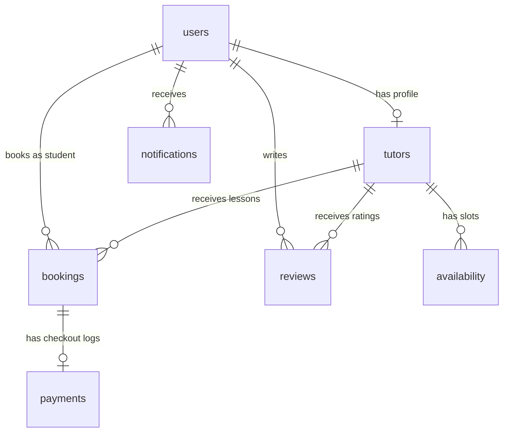

# Database Setup Instructions

TutorNow uses **SQLAlchemy ORM** to coordinate relational tables. The schemas are database-agnostic, meaning you can run them on **PostgreSQL** or **SQLite** depending on the configuration.

---

## 1. Table Relationships

The platform implements seven key tables mapping the entity relationships:



### Table Schemas:

1. **`users`**:
   - `id` (INTEGER, Primary Key)
   - `name` (VARCHAR)
   - `email` (VARCHAR, Unique, Indexed)
   - `password` (VARCHAR, Hashed)
   - `role` (VARCHAR) - *Student, Tutor, Admin*
   - `created_at` (DATETIME)

2. **`tutors`**:
   - `id` (INTEGER, Primary Key)
   - `user_id` (INTEGER, ForeignKey -> `users.id` CASCADE, Unique)
   - `subject` (VARCHAR)
   - `qualification` (VARCHAR)
   - `experience` (INTEGER) - *in years*
   - `hourly_rate` (FLOAT)
   - `bio` (TEXT)
   - `profile_image` (VARCHAR)
   - `rating` (FLOAT) - *updated dynamically upon reviews*
   - `is_verified` (BOOLEAN) - *toggled by admins*

3. **`availability`**:
   - `id` (INTEGER, Primary Key)
   - `tutor_id` (INTEGER, ForeignKey -> `tutors.id` CASCADE)
   - `date` (DATE) - *YYYY-MM-DD*
   - `start_time` (TIME)
   - `end_time` (TIME)
   - `status` (VARCHAR) - *Available, Booked*

4. **`bookings`**:
   - `id` (INTEGER, Primary Key)
   - `student_id` (INTEGER, ForeignKey -> `users.id` CASCADE)
   - `tutor_id` (INTEGER, ForeignKey -> `tutors.id` CASCADE)
   - `booking_date` (DATE)
   - `session_time` (VARCHAR) - *e.g., "10:00 - 11:00"*
   - `status` (VARCHAR) - *Pending, Accepted, Rejected, Cancelled*
   - `payment_status` (VARCHAR) - *Unpaid, Paid*

5. **`payments`**:
   - `id` (INTEGER, Primary Key)
   - `booking_id` (INTEGER, ForeignKey -> `bookings.id` CASCADE, Unique)
   - `amount` (FLOAT)
   - `payment_method` (VARCHAR)
   - `transaction_id` (VARCHAR, Unique)
   - `status` (VARCHAR) - *Pending, Success, Failed*

6. **`reviews`**:
   - `id` (INTEGER, Primary Key)
   - `student_id` (INTEGER, ForeignKey -> `users.id` CASCADE)
   - `tutor_id` (INTEGER, ForeignKey -> `tutors.id` CASCADE)
   - `rating` (FLOAT) - *range 1.0 to 5.0*
   - `comment` (TEXT)
   - `created_at` (DATETIME)

7. **`notifications`**:
   - `id` (INTEGER, Primary Key)
   - `user_id` (INTEGER, ForeignKey -> `users.id` CASCADE)
   - `message` (TEXT)
   - `status` (VARCHAR) - *Unread, Read*
   - `created_at` (DATETIME)

---

## 2. Table Creation & Initialization

When you run the FastAPI backend (`uvicorn main:app --reload`), the application executes:
```python
Base.metadata.create_all(bind=engine)
```
This automatically inspects the models and creates all tables, indexes, and constraints. You do not need to execute initial raw SQL commands.

---

## 3. Seeding the Database

We have included a database seeder script `seed.py`. To clear the database and populate clean sample data for instant dashboard operations:

1. Enter virtual environment.
2. Run the seeding tool:
   ```bash
   python seed.py
   ```
   *This drops existing tables, rebuilds them, and seeds a Student (Alex Smith), a Tutor (Dr. Jenkins), an Admin, open availability slots, past lessons, ratings reviews, and notifications.*
